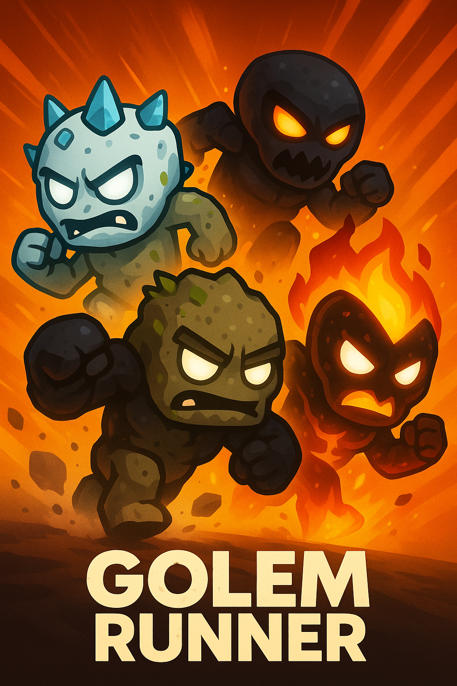

# Golem Runner 🌟

## 📱 About

Golem Runner is a captivating mobile endless runner where elemental golems race through magical realms. Built during the Starknet Hackathon: Re{ignite}, this game combines fun gameplay with powerful blockchain technology!

Players can:
- 🏃‍♂️ Control different elemental golems with simple tap controls
- 🔮 Unlock new golem characters with unique abilities
- 🏆 Compete on verifiable blockchain leaderboards
- 🌍 Progress through stunning elemental worlds
- 💰 Collect magical coins during their runs

## ✨ Features

- 🎮 **Addictive Gameplay**: Simple tap/swipe controls with increasing difficulty
- 🧱 **Collectible Golems**: Stone, Crystal, Lava and more elemental characters!
- 📊 **Secure Leaderboards**: Powered by blockchain, no cheating possible!
- 🎯 **Daily Challenges**: Special runs with unique rewards
- 📱 **Complete Mobile Experience**: Optimized for Android devices

## 🛠️ Tech Stack

- **Backend**: [Dojo Engine](https://dojoengine.org), Cairo, Starknet
- **Frontend**: React
- **Mobile**: PWA
- **Wallet**: [Cartridge Controller](https://cartridge.gg)
- **Network**: Sepolia testnet
